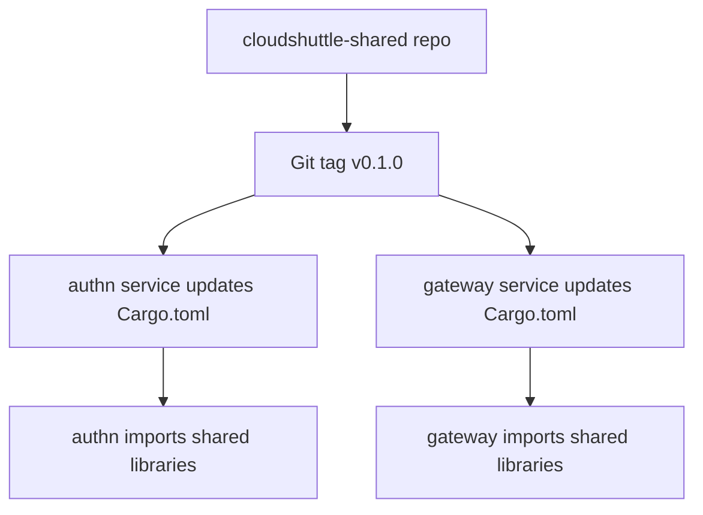

# CloudShuttle Shared Libraries - Publishing Strategy

## 📋 Publishing Options Analysis

### **Option 1: Public crates.io (Current Implementation)**

#### ✅ **Advantages**
- Standard Rust ecosystem practice
- Easy `cargo add cloudshuttle-error-handling`
- Automatic dependency resolution
- Public visibility (marketing/community)
- Free hosting and CDN
- Integration with docs.rs

#### ❌ **Disadvantages**
- **Security Risk**: Auth/crypto code becomes public
- **IP Exposure**: Business logic and internal patterns exposed
- **API Stability**: Must maintain backward compatibility forever
- **Breaking Changes**: Difficult to make without affecting public users
- **Maintenance Overhead**: Public support and issue management

#### 📊 **Risk Assessment: HIGH**
```
Security Impact: 🔴 HIGH (auth/crypto code public)
Business Impact: 🔴 HIGH (IP exposure)
Maintenance: 🟡 MEDIUM (API stability requirements)
```

---

### **Option 2: Private Cargo Registry**

#### ✅ **Advantages**
- Internal control over distribution
- Can keep code private
- Standard Cargo workflow
- Version management
- Access control (team-only)

#### ❌ **Disadvantages**
- Infrastructure setup required
- Private registry hosting costs
- Team access management
- Not as seamless as public registry

#### 📊 **Risk Assessment: LOW**
```
Security Impact: 🟢 LOW (private)
Business Impact: 🟢 LOW (internal control)
Maintenance: 🟡 MEDIUM (infrastructure)
```

#### **Implementation Options**
- **CloudSmith** (commercial private registry)
- **Artifactory** (enterprise artifact management)
- **Self-hosted** (using `cargo-registry` or similar)

---

### **Option 3: Git Dependencies (Recommended)**

#### ✅ **Advantages**
- **Zero infrastructure** - uses existing GitHub
- **Complete privacy** - code stays internal
- **Version control** - tags provide versioning
- **Easy updates** - direct Git access
- **No external dependencies**

#### ❌ **Disadvantages**
- Manual version management
- Git clone required for builds
- No automatic dependency resolution
- Slower initial builds (Git clones)

#### 📊 **Risk Assessment: LOW**
```
Security Impact: 🟢 LOW (private GitHub repo)
Business Impact: 🟢 LOW (internal control)
Maintenance: 🟡 MEDIUM (manual versioning)
```

#### **Implementation**
```toml
# In service Cargo.toml
[dependencies]
cloudshuttle-error-handling = { git = "https://github.com/cloudshuttle/cloudshuttle-shared.git", tag = "v0.1.0" }
```

---

### **Option 4: Monorepo Path Dependencies**

#### ✅ **Advantages**
- **Maximum privacy** - everything in one repo
- **Instant updates** - no publishing delays
- **Tight coupling** - perfect for shared code
- **No external registries**

#### ❌ **Disadvantages**
- **Monorepo complexity** - all code in one place
- **Version drift** - hard to manage versions across services
- **Deployment complexity** - single point of failure
- **Limited scalability** - as more services added

#### 📊 **Risk Assessment: MEDIUM**
```
Security Impact: 🟢 LOW (all internal)
Business Impact: 🟡 MEDIUM (repo management)
Maintenance: 🔴 HIGH (complexity)
```

---

## 🎯 **Recommendation: Git Dependencies**

For CloudShuttle's use case, I recommend **Git Dependencies** for the following reasons:

### **Why Git Dependencies?**

1. **🔒 Security First**: Code stays completely private in GitHub
2. **🎛️ Full Control**: No external dependencies or registries
3. **⚡ Simplicity**: No infrastructure to manage
4. **🔄 Flexibility**: Easy to update versions with Git tags
5. **🚀 Speed**: Fast setup, no complex infrastructure

### **Implementation Strategy**

#### **1. Repository Structure**
```
cloudshuttle/
├── cloudshuttle-shared/     # Shared libraries
│   ├── rust/crates/         # Rust crates
│   └── typescript/packages/ # TypeScript packages
├── cloudshuttle-authn/      # Service using shared libs
├── cloudshuttle-gateway/    # Service using shared libs
└── ...
```

#### **2. Dependency Declaration**
```toml
# cloudshuttle-authn/Cargo.toml
[dependencies]
cloudshuttle-error-handling = { git = "https://github.com/cloudshuttle/cloudshuttle-shared.git", tag = "v0.1.0" }
cloudshuttle-database = { git = "https://github.com/cloudshuttle/cloudshuttle-shared.git", tag = "v0.1.0" }
cloudshuttle-auth = { git = "https://github.com/cloudshuttle/cloudshuttle-shared.git", tag = "v0.1.0" }
```

#### **3. Version Management**
```bash
# Create new version
cd cloudshuttle-shared
git tag v0.1.0
git push origin v0.1.0

# Services update their Cargo.toml to new tag
```

#### **4. CI/CD Integration**
```yaml
# In service CI/CD
- name: Build shared libraries
  run: |
    git clone https://github.com/cloudshuttle/cloudshuttle-shared.git
    cd cloudshuttle-shared/rust
    cargo build --release
```

### **Migration Path**

#### **Current State**
- Shared libraries built but publishing to crates.io
- Services not yet using shared libraries

#### **Target State**


#### **Step-by-Step Migration**

1. **Keep shared libraries private** (no crates.io publishing)
2. **Tag initial release**: `git tag v0.1.0`
3. **Update authn service**:
   ```toml
   [dependencies]
   cloudshuttle-error-handling = { git = "https://github.com/cloudshuttle/cloudshuttle-shared.git", tag = "v0.1.0" }
   ```
4. **Migrate authn code** to use shared libraries
5. **Repeat for other services**

### **Benefits of This Approach**

#### **🔒 Security**
- All authentication, crypto, and business logic stays private
- No accidental exposure of sensitive code
- Full control over who can access the code

#### **🚀 Development Speed**
- Instant updates: tag new version, services update dependency
- No waiting for registry publishing
- Direct Git access for development

#### **🛠️ Maintenance**
- Single source of truth in GitHub
- Standard Git workflows and tools
- Easy rollback with Git tags

#### **📈 Scalability**
- Works with multiple repositories
- Easy to add new services
- No registry infrastructure scaling concerns

### **Handling TypeScript Packages**

For TypeScript packages, we have similar options:

#### **Option A: Private npm Registry**
```json
// package.json
{
  "dependencies": {
    "@cloudshuttle/components": "git+https://github.com/cloudshuttle/cloudshuttle-shared.git#v0.1.0"
  }
}
```

#### **Option B: Git Dependencies**
```json
{
  "dependencies": {
    "@cloudshuttle/components": "github:cloudshuttle/cloudshuttle-shared#v0.1.0"
  }
}
```

---

## 📋 **Action Plan**

### **Immediate Actions**
1. **❌ Remove crates.io publishing** from CI/CD pipeline
2. **✅ Implement Git dependencies** in shared library setup
3. **✅ Update documentation** to reflect private approach
4. **✅ Create initial Git tag** `v0.1.0`

### **Service Migration Order**
1. **authn** - Most duplicated code (error handling, auth, database)
2. **gateway** - Uses logging, config, error handling
3. **platform** - Database and API utilities
4. **cms** - Database, validation, API
5. **artifacts** - Database, crypto, API

### **Timeline**
- **Week 1**: Setup Git dependencies, tag v0.1.0, migrate authn
- **Week 2**: Migrate gateway and platform
- **Week 3**: Migrate remaining services
- **Week 4**: Testing, documentation, cleanup

---

## 🎯 **Final Recommendation**

**Use Git Dependencies** for maximum security, simplicity, and control.

**Why not crates.io?** CloudShuttle contains sensitive authentication, cryptographic, and business logic that should remain private. The minor convenience of public registry publishing doesn't outweigh the security and IP protection concerns.

**Why not private registry?** Git dependencies provide the same functionality with zero infrastructure overhead and complete privacy.

**Result**: Shared libraries that are secure, maintainable, and easy to use across all CloudShuttle services.
